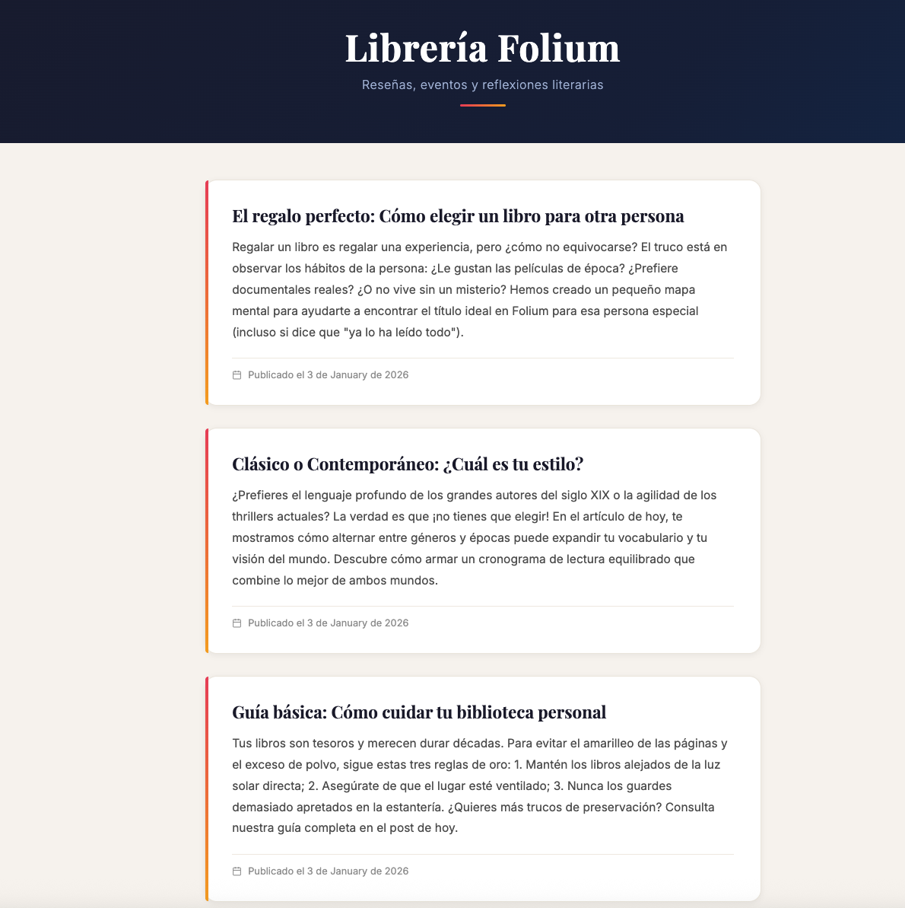
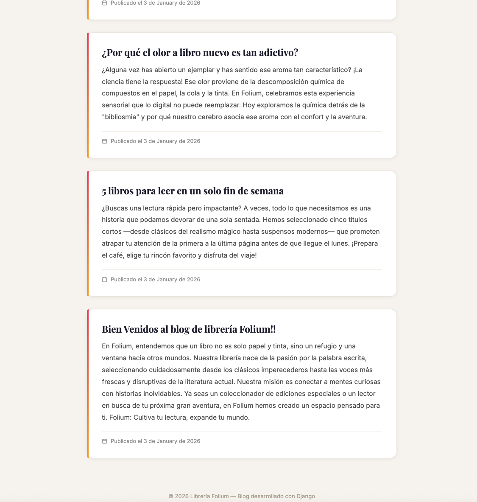
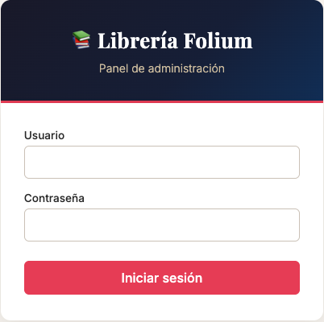
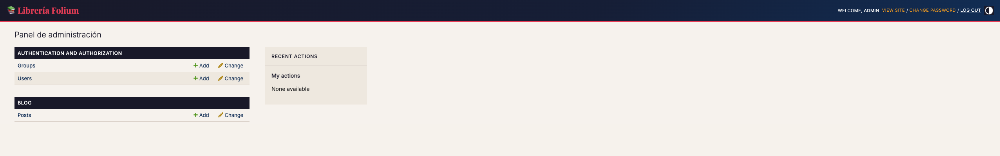
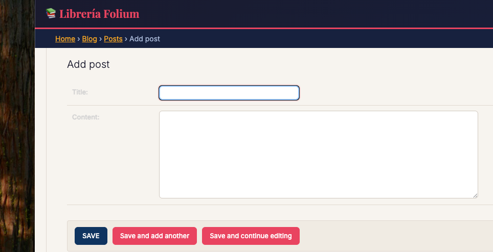
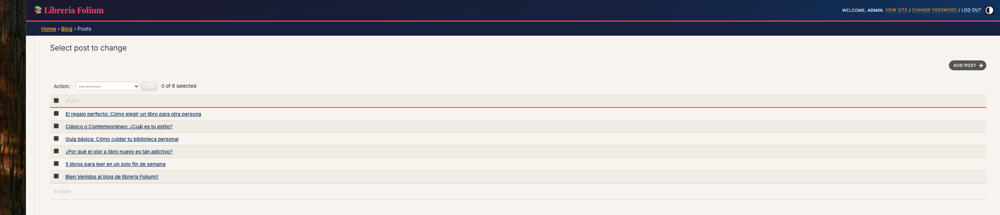
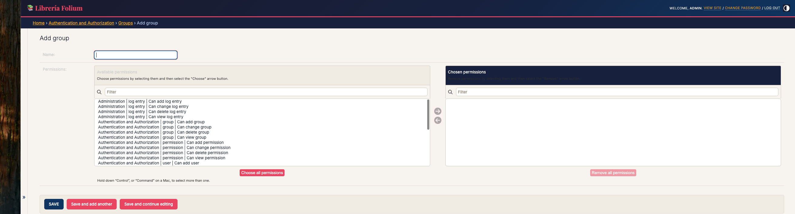
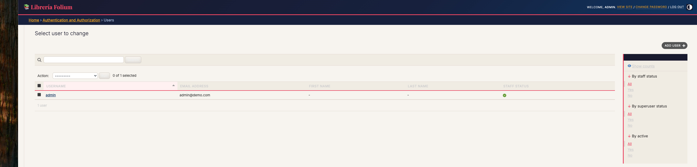

# 📚 Blog de Librería Folium

Prototipo de blog desarrollado con **Django** para una librería independiente. Permite publicar reseñas de libros, anunciar eventos y compartir reflexiones literarias. Las publicaciones se muestran en **orden cronológico inverso** (más reciente primero).

---

## 📸 Capturas de pantalla

### Blog público



### Panel de administración



### Gestión de contenido





---

## 🛠 Tecnologías

- Python 3.x
- Django 6.0
- SQLite (base de datos de desarrollo)
- Django Template Language (DTL)

---

## 📁 Estructura del proyecto

```
proyecto_Django_Blog/
├── manage.py              → CLI de Django
├── db.sqlite3             → Base de datos local (no se sube a GitHub)
├── requirements.txt       → Dependencias del proyecto
├── .gitignore             → Archivos excluidos del repositorio
│
├── blogproject/           → Configuración global del proyecto
│   ├── settings.py
│   ├── urls.py
│   ├── wsgi.py
│   └── asgi.py
│
└── blog/                  → Aplicación principal
    ├── models.py          → Modelo Post (título, contenido, fecha)
    ├── views.py           → Vista que recupera y ordena las publicaciones
    ├── urls.py            → Rutas de la aplicación
    ├── admin.py           → Registro en el panel de administración
    ├── apps.py
    ├── migrations/        → Historial de cambios en la base de datos
    └── templates/
        ├── blog/
        │   └── home.html  → Plantilla visual del blog
        └── admin/
            ├── base_site.html  → Tema personalizado del admin
            ├── login.html      → Pantalla de inicio de sesión
            └── logged_out.html → Pantalla de cierre de sesión
```

---

## 🚀 Cómo ejecutar el proyecto

1. **Clonar el repositorio:**
   ```bash
   git clone <url-del-repositorio>
   cd proyecto_Django_Blog
   ```

2. **Crear y activar un entorno virtual:**
   ```bash
   python -m venv venv
   source venv/bin/activate        # macOS/Linux
   venv\Scripts\activate           # Windows
   ```

3. **Instalar dependencias:**
   ```bash
   pip install -r requirements.txt
   ```

4. **Aplicar las migraciones** (crea la base de datos desde cero):
   ```bash
   python manage.py migrate
   ```

5. **Crear superusuario** para el panel de administración:
   ```bash
   python manage.py createsuperuser
   ```

6. **Iniciar el servidor:**
   ```bash
   python manage.py runserver
   ```

7. **Abrir en el navegador:**
   - Blog: [http://127.0.0.1:8000/](http://127.0.0.1:8000/)
   - Admin: [http://127.0.0.1:8000/admin/](http://127.0.0.1:8000/admin/)

> **Nota:** La base de datos (`db.sqlite3`) no se incluye en el repositorio por seguridad. Se genera automáticamente en el paso 4.

---

## ✨ Características

- Publicaciones ordenadas de más reciente a más antigua
- Panel de administración personalizado con tema visual propio
- Código documentado y separado por responsabilidades (MVT)
- Fácil de extender (comentarios, categorías, paginación, etc.)

---

## 🔒 Seguridad

- La `SECRET_KEY` se lee desde la variable de entorno `DJANGO_SECRET_KEY`. En desarrollo se usa una clave temporal por defecto.
- La base de datos local (`db.sqlite3`) **NO** se sube al repositorio.
- Las contraseñas de usuarios se almacenan hasheadas (PBKDF2 + SHA256).
